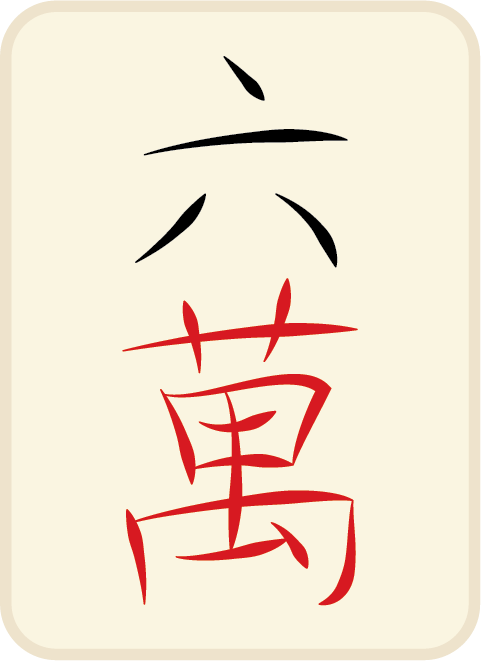
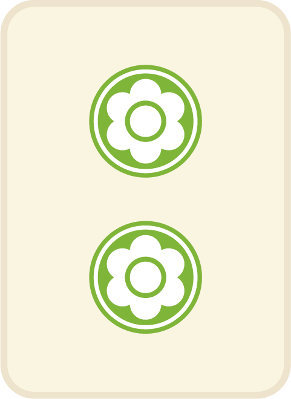
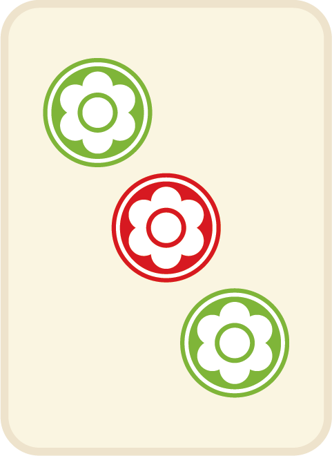
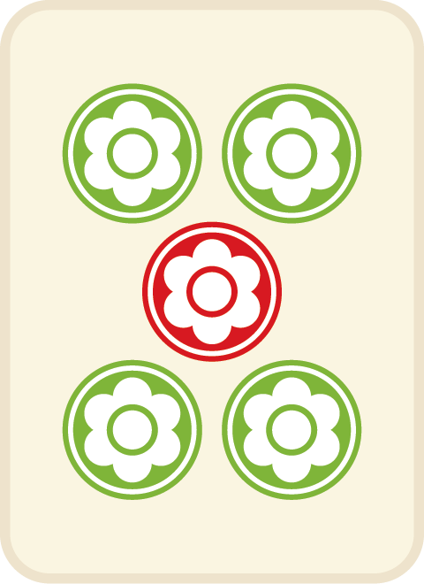
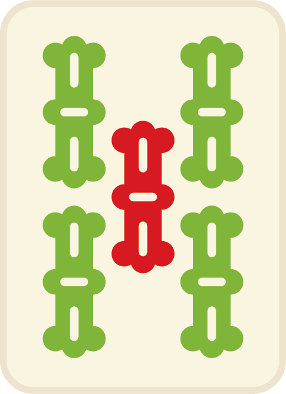
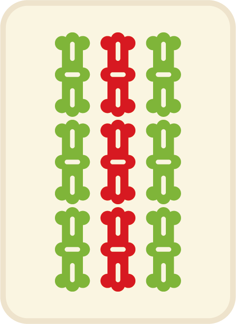
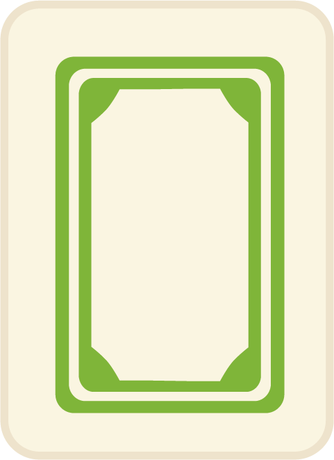
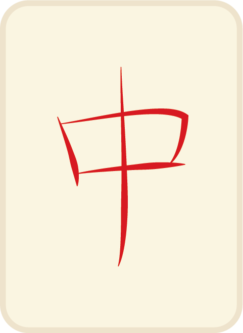

# Majhong (15112 Project)

### Description:

There are 4 players in total, banker will start first will have 14 tiles, other 3 players will have 13 tiles. The user is able to play with 3 AI.

There are (9*3+7) *4 tiles in total and they have the following category.

##### 万 (Wan) (Sequence)

##### 筒 (Tong) (Sequence)

##### 条 (Tiao) (Sequence)

##### 风 (Feng)

##### 白板，发财，红中 (Other tiles)

Each round, player will have to draw a tile and discard a card. 

In the middle of the game, people can have 2 special action: Peng 碰/Gang杠

##### Peng Action (碰): 

If player A discarded a tile, which Player B have 2 same tiles. Player B can take the Peng action and have all three tiles into the action tiles stack. And the game will enter player B round. Player B will discard a tile.

##### Gang Action (杠): 

Type1

If player A discarded a tile, which Player B have 3 same tiles. Player B can take the Gang action and have all four tiles into the action tiles stack. And the game will enter player B round. Player B will draw a tile first and then discard a tile.

Type 2

If player A in his round has 4 same tiles, he can use the Gang action to take all four tiles into the action tiles stack. He will draw a tile and discard a tile.

##### Hu (胡) (Winning): 

The first person reaches the combination of AA+nBBB+nCDE or AABBCCDDEEFFGG 7 pairs will win the game! Different combination of tiles will decide the points which the winner wins.

### Library requirement:

Required library: python(3.8), pygame

### How to run the game

In order to run the game, please clone all the packages to your local directory and run the screen.py file to run the whole game! 

REMEMBER to download the pic folder and sound folder, otherwise the game will not run with pictures and sound effects!!!

### Game Live Images

##### Demo1

##### Demo2

##### 

##### Demo3

##### 

##### Lost page

##### 

##### Win Page

